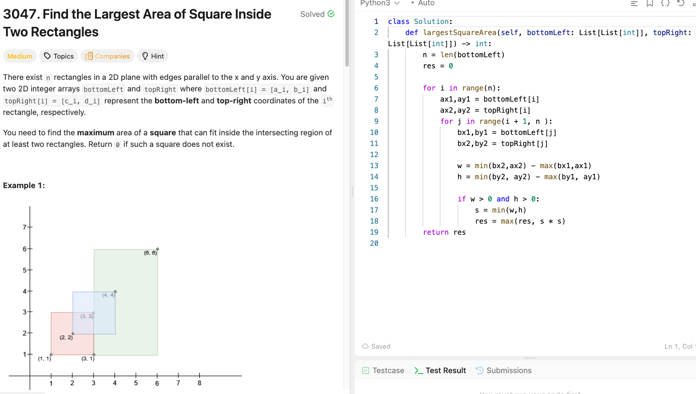

# LC3047 - Find the Largest Area of Square Inside Two Rectangles

## Metadata

- **Difficulty**: Medium
- **Topics**: Array, Math, Geometry， Weekly Contest 386
- **Link**: https://leetcode.com/problems/find-the-largest-area-of-square-inside-two-rectangles/description/

## What I got wrong / confused

I forgot the standard way to compute the **intersection rectangle** (overlap) and handle the **no-overlap** case correctly.

## Correct idea (high level)

For two axis-aligned rectangles:

- Overlap width:
  - `w = max(0, min(ax2, bx2) - max(ax1, bx1))`
- Overlap height:
  - `h = max(0, min(ay2, by2) - max(ay1, by1))`

The biggest square that fits inside the overlap has:

- `side = min(w, h)`
- `area = side * side`

If `w == 0` or `h == 0`, the overlap is empty, so the square area is `0`.

If the problem gives **n rectangles** and asks for “at least two rectangles”, compute the above for **every pair** and take the maximum.

## Key steps / pseudo

- Iterate all pairs `(i, j)` (or just compute once if only 2 rectangles are given).
- Compute `w` and `h` using min/max + clamp to 0.
- `side = min(w, h)`, update `ans = max(ans, side * side)`.

## Complexity

- **Time**: \(O(n^2)\) for n rectangles (pairwise intersections)
- **Space**: \(O(1)\)

## Screenshot

